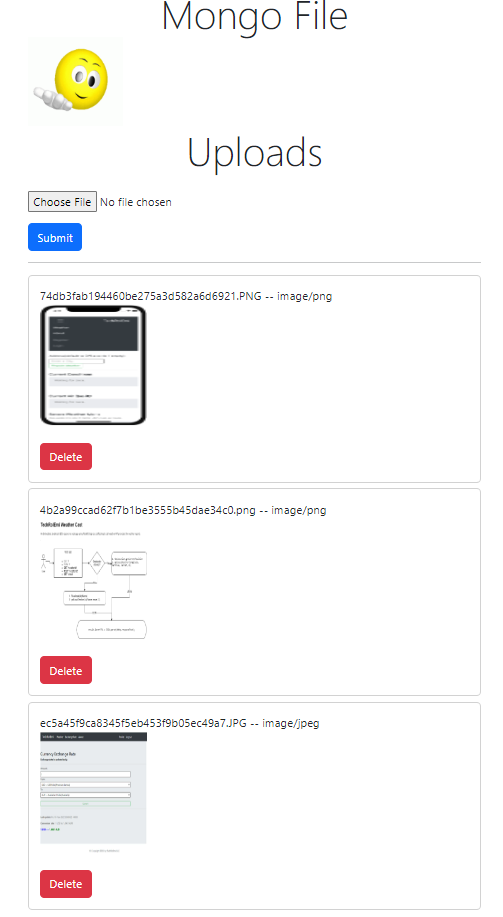

# MongoDB File Uploads

Media files can be the big source of run-time latency.  Especially if loading from local drive.  One solution is to store them on CDN or cloud database server.

This mini project demonstrates one way to upload media files {jpeg, png, gif, txt, ico, webm, pm4,...} to MongoDB. Then, download them as stream to display and minipulate(Delete) on the browser.


[ref 1](https://github.com/aheckmann/gridfs-stream) gridfs-stream

[ref 2](https://github.com/devconcept/multer-gridfs-storage) multer-gridfs-storage

MongoDB has a driver specification to upload and retrieve files from it called GridFS. GridFS allows you to store and retrieve files, which includes ones exceeding the BSON-document size limit of 16 MB.

The packages needed to initialize the engine are multer-gridfs-storage and multer. We also use method-override middleware to enable the delete operation for files. The npm module crypto is used to encrypt the filenames on being stored and read from the database.

Once the storage engine using GridFS is initialized, you have to just call it using the multer middleware. It is then passed to the respective route executing the various file storage operations.

<br />



## Let's go

It's a well commented code, you'll learn more by going over it.  Cheers!

It is assumed that you are somewath familiar with node.js dotenv.  You are to replace `MONGO_URI` with your own database connection info.

<strong>Set up NodeJS project</strong>

```javascript

npm init -y
npm install body-parser ejs express gridfs-bucket gridfs-stream method-override mongoose multer multer-gridfs-storage dotenv
npm install --save-dev nodemon


// insert npm directive in package.json
  "scripts": {
    "start": "node app.js",
    "dev": "nodemon app.js"
  },


// open in vscode
code .

// run
npm run dev
```

<br />
Main driver `app.js`

```javascript
const express = require('express');
const app = express();
const gridfsRouter = require('./routes/gridfs-routes.js');

app.set('view engine', 'ejs');


// Allow access to 'public' folder where resources are available to this app
app.use(express.static('public'));

// Routes handlers: https://localhsot:5000/upload/
app.use('/upload', gridfsRouter);

const port = 5000;
app.listen(port, () => {
    console.log('MongoUpload server is listening on ' + port);
})
```

## Responsive [bootstrap](https://getbootstrap.com/)

<strong>Reference CSS and JS via CDN</strong>:

```html
<header>
<!-- CSS only -->
<link href="https://cdn.jsdelivr.net/npm/bootstrap@5.2.3/dist/css/bootstrap.min.css" rel="stylesheet" integrity="sha384-rbsA2VBKQhggwzxH7pPCaAqO46MgnOM80zW1RWuH61DGLwZJEdK2Kadq2F9CUG65" crossorigin="anonymous">
...
</header>

<body>
    ...

    <!-- JavaScript Bundle with Popper -->
    <script src="https://cdn.jsdelivr.net/npm/bootstrap@5.2.3/dist/js/bootstrap.bundle.min.js" integrity="sha384-kenU1KFdBIe4zVF0s0G1M5b4hcpxyD9F7jL+jjXkk+Q2h455rYXK/7HAuoJl+0I4" crossorigin="anonymous"></script>
</body>
```

## [Using GridFS with Moongoose](https://github.com/aheckmann/gridfs-stream)

Initialize mongoose stream

## [Using Multer-GridsFS-Storage](https://github.com/devconcept/multer-gridfs-storage)

All file meta-data (file name, upload date, contentType, etc) are stored in a special mongodb collection separate from the actual file data. This collection can be queried directly:

```javascript
  gfs.findOne({ _id: '54da7b013706c1e7ab25f9fa'}, function (err, file) {
    console.log(file);
  });
```

### [Accessing file metadata -- createReadStream from GridFS](https://github.com/aheckmann/gridfs-stream)

To stream data out of GridFS we call createReadStream passing any options, at least an _id or filename.

```javascript
//  passing any options, at least an _id or filename.
var readstream = gfs.createReadStream(options);
readstream.pipe(response);

//or, get partial data with createReadStream, use range option
var readstream = gfs.createReadStream({
  _id: '50e03d29edfdc00d34000001',
  range: {
    startPos: 100,
    endPos: 500000
  }
});
```


